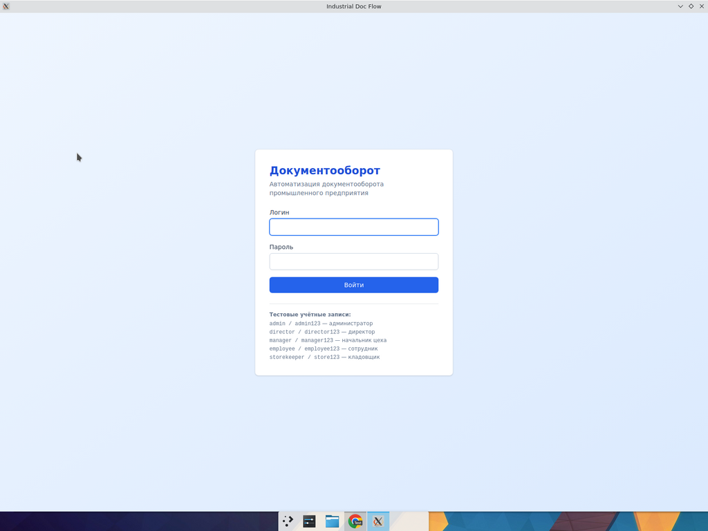

# Руководство пользователя

## 1. Запуск приложения

После установки запустите ярлык **Industrial Doc Flow** на рабочем столе или
из меню приложений. На первом запуске будет автоматически создана локальная
база данных и наполнена тестовыми данными (5 пользователей и 5 шаблонов).

## 2. Вход в систему

1. Введите **логин** и **пароль**.
2. Нажмите **«Войти»**.

Тестовые учётные записи указаны прямо на экране входа:

| Логин         | Пароль        | Роль          |
| ------------- | ------------- | ------------- |
| `admin`       | `admin123`    | Администратор |
| `director`    | `director123` | Руководитель  |
| `manager`     | `manager123`  | Руководитель  |
| `employee`    | `employee123` | Сотрудник     |
| `storekeeper` | `store123`    | Сотрудник     |

При неверных данных появится сообщение об ошибке. После входа сессия
сохраняется автоматически до явного выхода.

## 3. Главное меню (боковая панель)

После входа слева появляется навигация. Состав пунктов зависит от роли:

| Пункт              | employee | manager | admin |
| ------------------ | :------: | :-----: | :---: |
| Дашборд            | ✓        | ✓       | ✓     |
| Документы          | ✓        | ✓       | ✓     |
| Новый документ     | ✓        | ✓       | ✓     |
| На согласовании    |          | ✓       | ✓     |
| Пользователи       |          |         | ✓     |
| Журнал аудита      |          |         | ✓     |

В нижней части панели — карточка пользователя и кнопка **Выйти**.

## 4. Дашборд

Сводка по документообороту:

- Всего документов
- По каждому статусу (Черновики / На согласовании / Утверждён / Отклонён / Исполнен)
- **Ждут моего согласования** — счётчик документов, где вы текущий согласующий
- **Просрочено** — документы, которые висят на согласовании более 3 дней
- Список последних 8 документов

## 5. Создание документа

1. Нажмите **«+ Новый документ»** в шапке списка или в боковом меню.
2. Выберите **тип документа** из списка шаблонов.
3. Введите **тему** (краткое название). По умолчанию — название шаблона.
4. Заполните поля формы (обязательные помечены `*`).
5. Выберите **маршрут согласования**: отметьте галочками руководителей в
   нужном порядке. Цифры рядом с галочкой показывают шаг согласования (1, 2, …).
6. Нажмите **«Создать черновик»**.

Документ получает уникальный номер вида `MEMO-2026-0001` и сохраняется
в статусе **Черновик**.

### 5.1. Доступные шаблоны

| Шаблон                          | Назначение                                                     |
| ------------------------------- | -------------------------------------------------------------- |
| Служебная записка               | Произвольное информирование/запрос внутри предприятия          |
| Заявка на материалы             | Запрос материалов со склада                                    |
| Приказ                          | Распорядительный документ (издаётся руководителем)             |
| Акт                             | Приёмка / списание / выполненные работы / брак                 |
| Заявка на ремонт оборудования   | В службу главного механика                                     |

## 6. Работа с документом

Откройте документ из списка или дашборда. Доступные действия зависят от
вашей роли и статуса документа:

### 6.1. Автор черновика

- **Отправить на согласование** — переводит документ в статус «На согласовании».
- **Удалить черновик** — безвозвратно удаляет неотправленный черновик.
- **Экспорт в PDF** — сохраняет документ в PDF.
- **Печать** — открывает диалог печати.

### 6.2. Согласующий

Если вы — текущий шаг согласования, в нижней части появится блок:

- Поле **«Комментарий»** (обязательно при отклонении).
- Кнопка **«Согласовать»** — переводит к следующему шагу. Если шаг последний,
  документ становится утверждённым.
- Кнопка **«Отклонить»** — переводит документ в статус «Отклонён», все
  оставшиеся шаги получают статус «Пропущено».

### 6.3. После утверждения

- **Отметить как исполнено** — для утверждённых документов (только автор или
  администратор). Применяется, например, после фактической выдачи материалов.
- **В архив** — для завершённых документов (утверждённых, отклонённых,
  исполненных).

## 7. Поиск и фильтры

В разделе **Документы** доступны:

- **Поиск** по номеру, теме и содержимому документа (нажмите Enter или
  кнопку «Найти»).
- **Фильтр по статусу**.
- **Только мои** — оставить только документы, где вы автор.

## 8. На моём согласовании (для руководителей)

Раздел показывает все документы, где вы — текущий ожидающий шаг. Это
ваша рабочая очередь — открывайте по очереди и принимайте решение.

## 9. Управление пользователями (для администратора)

В разделе **Пользователи**:

- Просмотр всех пользователей с указанием роли, подразделения и статуса.
- **«+ Добавить»** — форма создания нового пользователя:
  - Логин, пароль (минимум 6 символов)
  - ФИО
  - Роль: сотрудник / руководитель / администратор
  - Подразделение, должность
- **«Отключить» / «Активировать»** — деактивация без удаления (отключённый
  пользователь не сможет войти в систему, но история действий сохраняется).

## 10. Журнал аудита (для администратора)

Раздел показывает 500 последних действий в системе:
вход, смена пароля, создание/согласование/отклонение документов,
управление пользователями. Каждая запись содержит дату, пользователя,
действие, объект и текстовые детали.

## 11. Экспорт в PDF

Кнопка **«Экспорт в PDF»** на странице документа открывает диалог
сохранения. PDF содержит:

- Заголовок документа
- Номер, статус, дату создания
- Полный текст документа (с поддержкой кириллицы)
- Маршрут согласования с комментариями и датами

## 12. Часто задаваемые вопросы

**Я забыл пароль. Что делать?**
Обратитесь к администратору — он может пересоздать вашу учётную запись или
сбросить пароль через прямое редактирование БД (см. инструкцию администратора).

**Где хранятся данные?**
В файле SQLite в каталоге пользовательских данных Electron:
- Linux: `~/.config/Industrial Doc Flow/doc-flow.sqlite`
- Windows: `%APPDATA%\Industrial Doc Flow\doc-flow.sqlite`
- macOS: `~/Library/Application Support/Industrial Doc Flow/doc-flow.sqlite`

**Как сделать резервную копию?**
Скопируйте файл `doc-flow.sqlite` (приложение должно быть закрыто).

**Можно ли удалить документ из архива?**
Нет, архивные документы остаются для аудита. Можно удалять только черновики.

**Что значит «просрочено»?**
Документ находится в статусе «На согласовании» более 3 дней.
